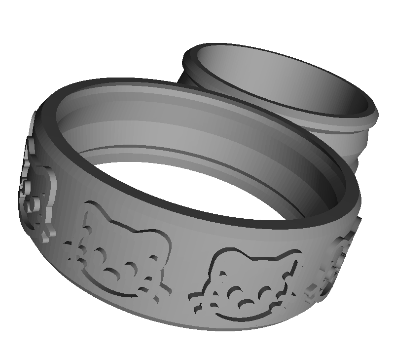

# 😺 Customizable Fidget Ring with a Cat!

A fun, 3D-printable fidget ring that you can make uniquely yours. This design features a smooth spinning band and an outer ring decorated with a cute cat silhouette. Spin it, fidget with it, and make it your own!

The best part? You can easily change everything from the ring size to the number of cats, or even swap the cat out for your own custom design using an SVG file. This was my first project in OpenSCAD, so it's a perfect starting point for anyone wanting to dip their toes into 3D modeling.

## ✨ Features

*   **Endlessly Customizable:** Tweak the parameters in the OpenSCAD file to get the perfect fit and look.
*   **Smooth Spinning Action:** Designed for a satisfying and seamless fidgeting experience.
*   **Bring Your Own Design:** Easily use any SVG file to create a ring that shows off your style.
*   **Beginner-Friendly:** A simple and well-commented `.scad` file makes it easy to get started.

## 🛠️ How to Customize Your Ring

Ready to create your purr-fect ring? You'll need to have [OpenSCAD](https://openscad.org/) installed.

1.  **Open the `.scad` file** in OpenSCAD.
2.  **Look for the parameters section** at the top of the file.
3.  **Change the values** to customize your ring. Here are the key options you can play with:
    *   `ring_size`: The internal size of the ring (for your finger).
    *   `ring_height`: How tall the ring is.
    *   `ring_diameter`: The overall diameter of the ring assembly.
    *   `thinnest_layer`: Sets the minimum thickness for printable parts.
    *   `bearing_intrusion` & `bearing_gap`: Fine-tune the spacing for the spinning mechanism.
    *   `resolution`: Adjust the smoothness of the curves.
    *   `num_cats`: Choose how many cats you want on your ring!
4.  **To use your own design**, simply update the SVG file path in the code.
5.  **Press F6** to render your new design.
6.  **Go to `File > Export > Export as STL`** to save the file for 3D printing!

## 🖨️ Printing Recommendations

*(This section is a work in progress! I will be testing various materials and settings to find the best way to print this ring and will update this space soon.)*

## 🙏 Acknowledgements

This project wouldn't have been possible without the amazing work of others in the community. A huge thank you to:

*   The original customizable ring concept by **[pikafoop](https://www.thingiverse.com/thing:1182425)** on Thingiverse & **[Pikaworx](https://pikaworx.com/)**.
*   Cat SVG by **[SVG Repo](https://www.svgrepo.com/svg/522779/cat)**.